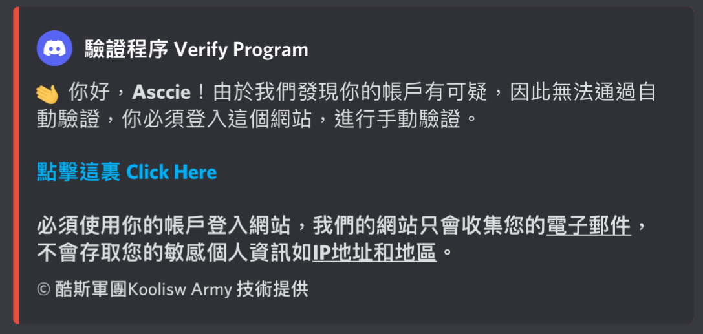
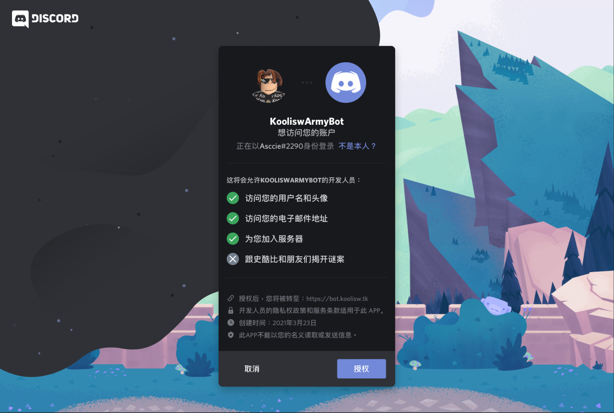
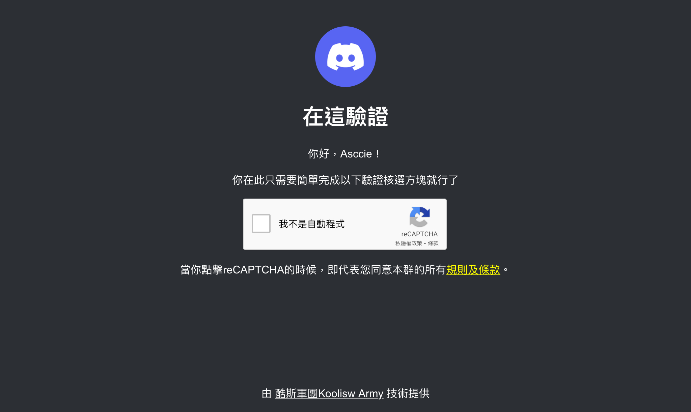
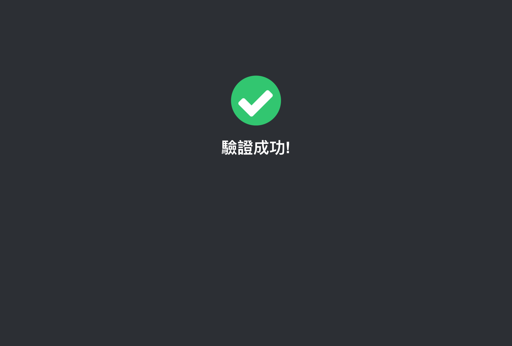
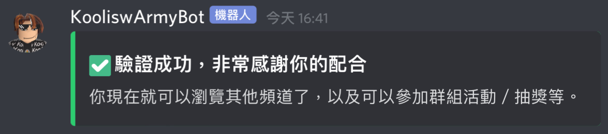

# 進階入群驗證

### 溫馨提示，即是進階手動驗證也需要達到某項條件，也是為了保護群組安全而設立的。

1. 必須在帳戶連結電子郵件
2. 必須驗證電子郵件

#### 以下進階入群驗證的主要方式為網站點選驗證，網站基於群主自主開發，只會收集你的帳戶電子郵件、驗證狀態、編號，並不會收集你的敏感個人資料。

驗證網站: [https://bot.koolisw.tk/verify](https://bot.koolisw.tk/verify) \(在驗證時在私訊提供\)

當你點擊機器人按鈕的時候，你將會收到機器人的私訊（緊記在伺服器的私隱設定中開啟允許私人訊息），然後點擊訊息中的連結。

然後，進入網站後將會收到帳戶登入頁面，並點擊授權。

當你完成登入之後，你將會在頁面中間看見「我不是自動程式」點選按鈕。然後你完成彈出介面的圖片點選驗證。

驗證完成後，系統將會自動導向其他頁面，如果顯示驗證完成的頁面，即代表你成功了。

你返回你的Discord應用程式或者網頁，就將會收到以下來自機器人私人訊息的通知。並可以解鎖伺服器的其他頻道。


驗證時，系統顯示錯誤頁面？ 請瀏覽[常見問題頁面](https://docs.koolisw.tk/discord-joinverify/faq)


