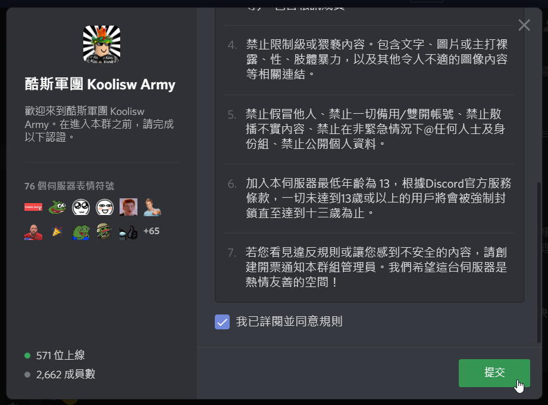
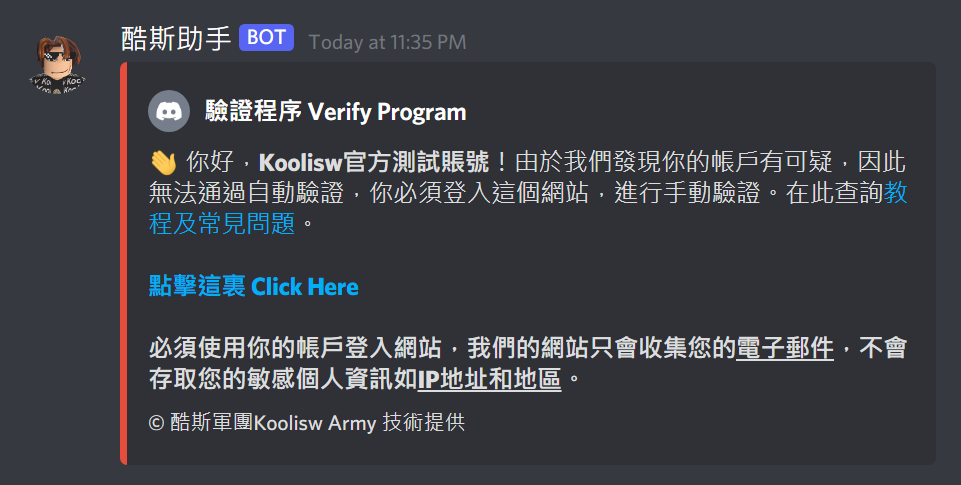
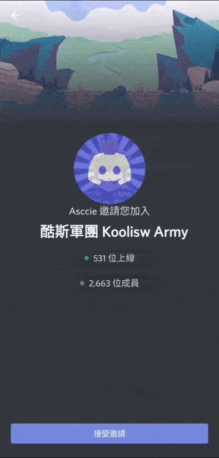
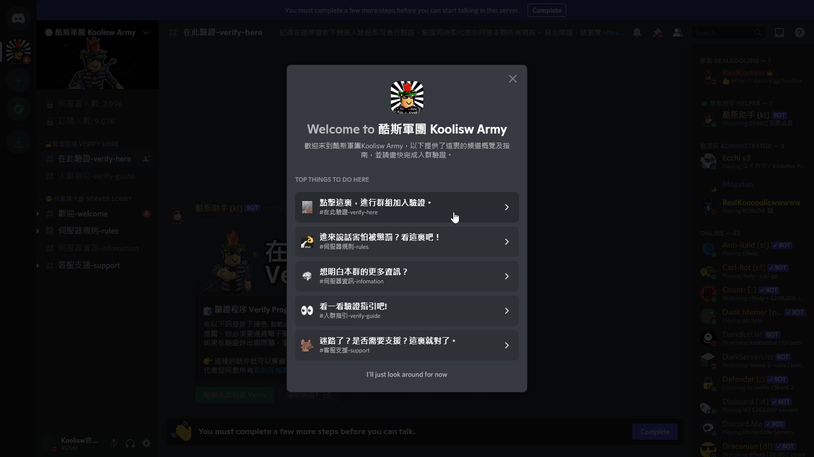

# 基本入群驗證


請注意，以下步驟為自動驗證。為了伺服器安全，所有加入用戶必須要達到以下要求才能夠進行自動驗證。否則要進行手動加入驗證。


1. 帳戶創建日期必須超過14天
2. 帳戶必須擁有自訂圖標\(不包括預設\)

### 如果你要進行手動驗證，請[瀏覽](advanced.md)這裏了解進階驗證的過程及步驟。

加入此群組後，由於我們的群組安全級別，您需要驗證您的電子郵件和帳戶創建時間應超過 5 分鐘。

然後你需要接受並按下規則確認界面確認按鈕。


Android 或 iOS 用戶的移動應用程序可能存在規則確認界面消失錯誤問題。  
您可以重新啟動應用程序並重新確認規則界面。


然後你就可以按下驗證[頻道](https://discord.com/channels/687219262406131714/770157889172013056/)上的機器人綠色按鈕。


驗證時，按鈕出現「互交失敗」？ 請瀏覽[常見問題頁面](https://docs.koolisw.tk/discord-joinverify/faq)


### Android介面驗證影片:

可能存在規則確認界面消失錯誤問題。  
您可以重新啟動應用程序並重新確認規則界面。

### iOS/iPadOS介面驗證影片:

可能存在規則確認界面消失錯誤問題。  
您可以重新啟動應用程序並重新確認規則界面。

### 電腦/網頁版介面驗證影片:

可能存在規則確認界面消失/無法顯示點擊錯誤問題。  
您可以重新啟動電腦應用程式或者重新加載網頁解決問題。

