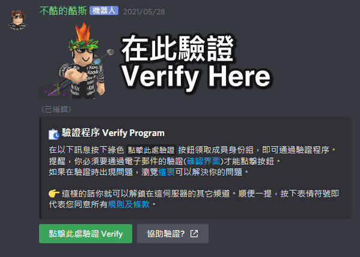

# 驗證常見問題 FAQ

## 驗證時，點擊按鈕出現「互交失敗」？

這是因為你仍未接受和仍未按下規則接受界面的按鈕，你必須接受及同意規則接受界面才能夠有權限點擊驗證按鈕。Android 或 iOS 用戶的移動應用程序可能存在規則確認界面消失錯誤問題。您可以重新啟動應用程序並重新確認規則界面。

## 為什麼我驗證了電子郵件&符合驗證要求，亦無法驗證並且出現「互交失敗」？

經過我們的詳細發現，主要原因是規則接受界面無法顯示，這可能就是你的應用程式或者網頁出現問題，要解決這個問題，你可以透過重新加載頁面和重新啟動應用程式，接受規則頁面的所有規則並按下同意，問題就可以解決及可以順利通過認證。

## 進階驗證: 為什麼驗證網站顯示「你尚未驗證你的電子郵件」？

因為你沒有把你的帳戶連結的電子郵件進行驗證，我們無法確保該電子郵件是你擁有的，因此我們務必要求你完成驗證。才能夠通過手動驗證的最低要求。

## 進階驗證: 我想知道到底驗證網站會收集我什麼的用戶資料？會不會分享至第三方？

至於在網站中，是基於Koolisw的安全保管及穩定開發，明白都用戶對於驗證網站用戶資料收集的擔憂。事實上，我們只會收集用戶的電子郵件、驗證狀態、用戶編碼、用戶名、及你的所在伺服器。所有資料基於Discord API，並不會收集你的IP地址、請求地區、Cookie等，也不會分享至第三方。至於IP地址匹配，本群亦有保留，匹配並封鎖來自惡意行為或破壞之請求IP。

