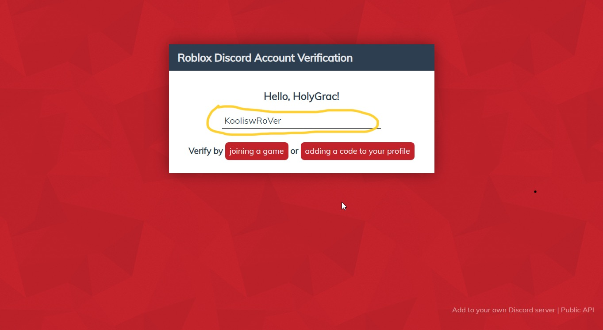

# ROBLOX身份驗證

首先, 你就必須在驗證身份頻道, 輸入指令 **!verify**, 並且等待機械人給你的網站連結進行驗證\(該網站是開源並且已經由別人驗證認可\), 然後點擊連結

然後, 點擊網頁後, 按下 **Sign in with Discord**, 並使用你的**Discord**帳戶登入, 授權你的帳戶登入該網站

並且, 當你完成授權帳戶後, 你的裝置將會出現這個頁面, 並且, 在以下黃色標注區域的地區輸入**你要驗證的ROBLOX用戶名字**, 並且按下**adding a code to your profile**

然後就會出現一大堆文字, 在此你就要把他們複製貼上到你的roblox用戶說明欄中, 就按下 **copy to clipboard**  

前往你的Roblox人物介紹, 貼上相關字詞, 即使你擁有其他簡介文字, 只要複製貼上就行了, 然後按下**儲存**

返回該網站, 並且按下**done**

完成驗證

**還未完!** 務必返回該驗證頻道, 並重新輸入 **!verify**

終於完成驗證, 感謝你的配合, 恭喜!

